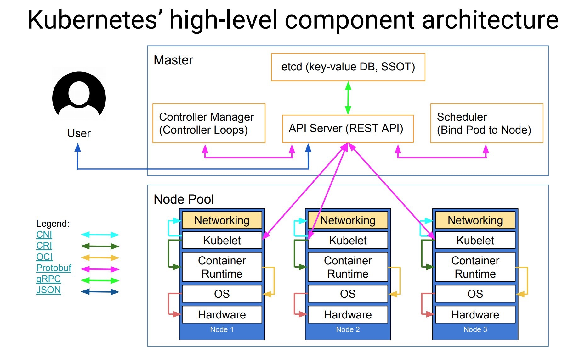
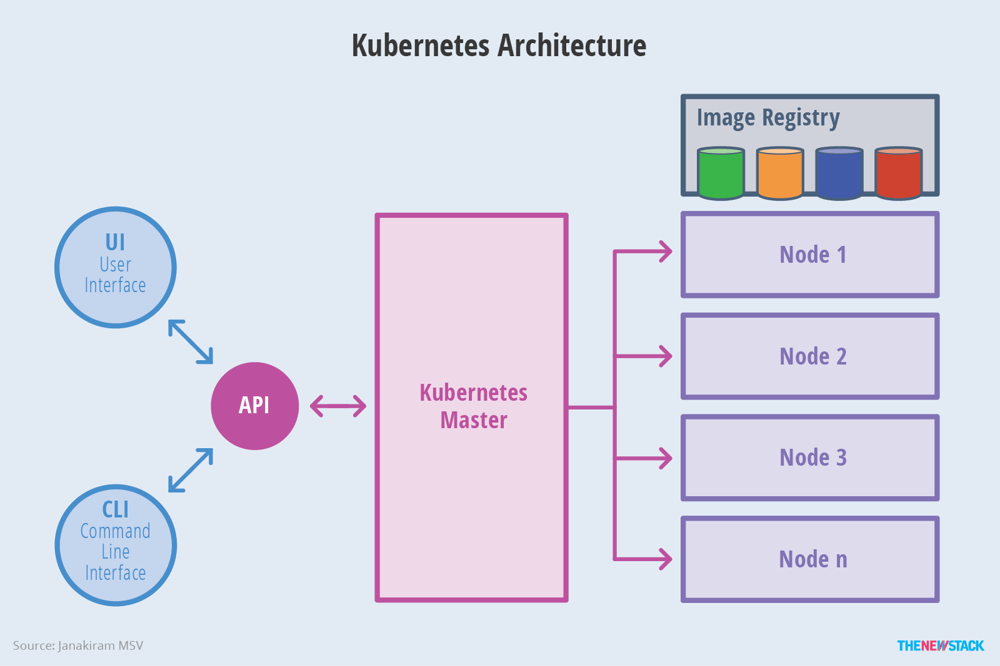
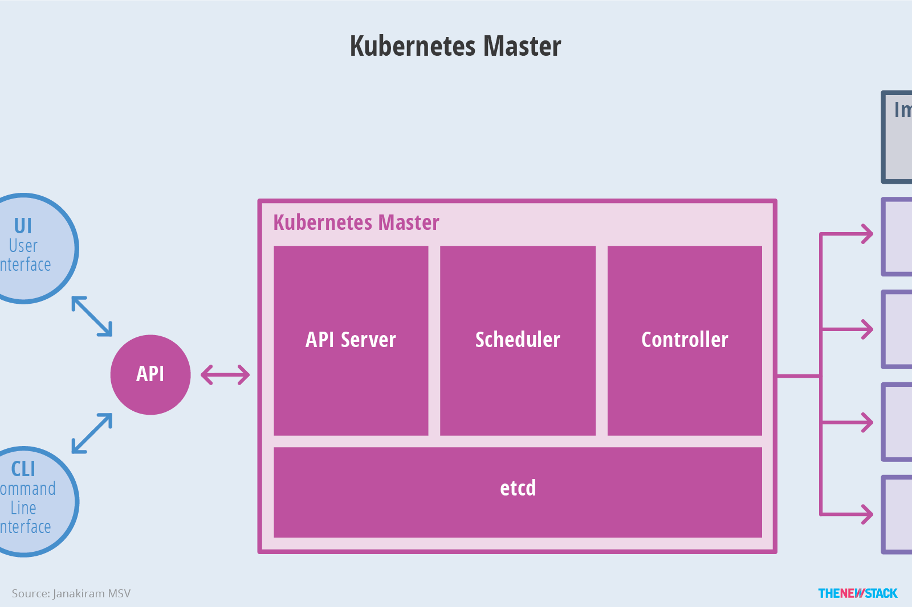
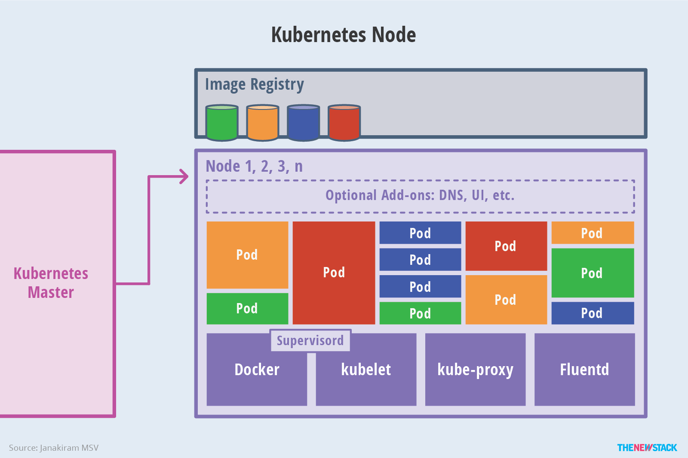
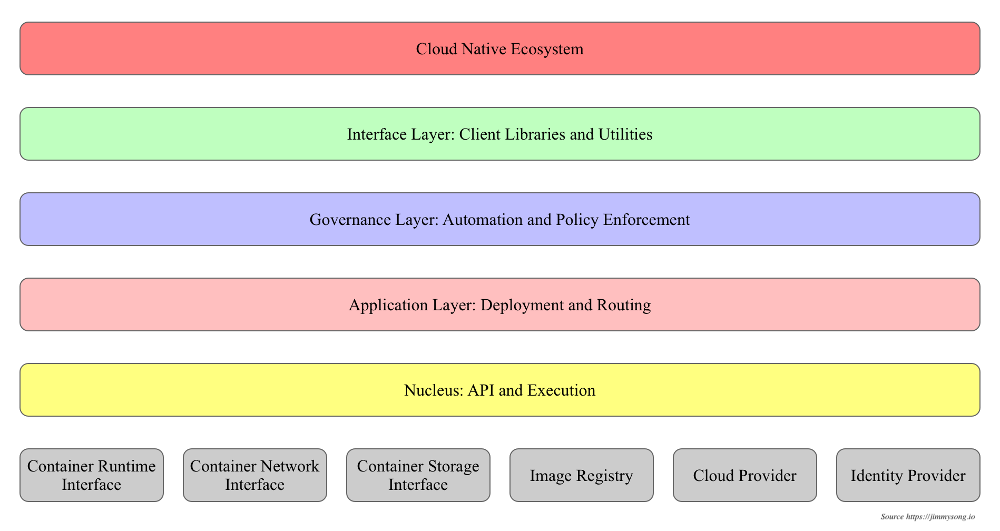
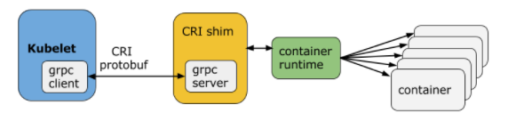

```toc
```


# 基础架构

> [Kubernetes 基础教程 | 云原生资料库 (jimmysong.io)](https://lib.jimmysong.io/kubernetes-handbook/)











## API设计原则

`kubernates` 集群系统每支持一项新功能, 引入新技术一定会引入对应的 `API` 对象, 支持对该功能的管理操作, API设计有以下的原则.

1. 所有API是声明式的, 隐含了所有的API对象都是名词性质的.
2. API对象是彼此互补而且可组合的.
3. 高层API以操作意图为基础设计, 从业务出发, 即以系统调度管理容器的操作意图为基础设计.
4. 低层API根据高层API的控制需要设计.
5. 避免简单封装, 不要在外部API无法显式知道的内部隐藏机制.
6. API操作复杂度与对象数量成正比.
7. API对象状态不能依赖于网络连接状态.
8. 尽量避免让操作机制依赖于全局状态, 因为在分布式系统中要保证全局状态的同步是非常困难的.

## 控制机制设计原则

1. 控制逻辑应该只依赖于当前状态.
2. 假设任何错误的可能, 并做容错处理.
3. 尽量避免复杂状态机, 控制逻辑不要依赖无法监控的内部状态.
4. 假设任何操作都可能被任何操作对象拒绝, 甚至被错误解析.
5. 每个模块都可以在出错后自动恢复.
6. 每个模块都可以在必要时优雅地降级服务

## Pod

`Pod` 是在集群中运行部署应用或服务的最小单元, 它是可以支持多容器的. 它的设计理念是支持多个容器在一个 `Pod` 中共享网络地址和文件系统, 可以通过进程间通信和文件共享组合完成服务.

## RC(Replication Controller) 副本控制器

`RC` 是集群中最早的保证 `Pod` 高可用的 `API` 对象. 通过监控运行中的 `Pod` 保证集群中运行指定数目的 `Pod` 副本. 可以是多个也可以是一个. 少于指定数目就会启动运行新的 `Pod` 副本, 多于指定数目就会杀死多余的副本.

## RS(Replica Set) 副本集

`RS` 是新一代的 `RC` , 提供同样的高可用能力, 区别主要在于 `RS` 后来居上, 能支持更多种类的匹配模式, 一般不单独使用, 而是作为 `Deployment` 的理想状态参数使用.

## Deployment 部署

表示用户对集群的一次更新操作. `Deployment` 是一个比 `RS` 应用模式更广的 `API` 对象. 可以是创建一个新服务, 更新一个新服务, 或者滚动升级一个服务. 滚动升级一个服务, 实际上是创建一个新的 `RS` 服务, 然后逐渐将新 `RS` 副本数增加到理想状态, 旧的副本减小到0的复合操作.

## Service 服务

上面几个只是保证了支持服务的微服务 `Pod` 的数量, 但是没有解决如何访问这些服务的问题. 一个 `Pod` 只是一个运行服务的实例, 随时可能在一个节点上停止, 在另一个节点以一个新的 `IP` 启动一个新的 `Pod`, 因此不能以确定的 `IP` `Port` 提供服务. 要稳定地提供服务发现和负载均衡能力. 服务发现完成的动作, 是针对客户端访问的服务, 找到对应的后端服务实例. 在集群中, 客户端需要访问的服务就是 `Service` 对象.

## Job 任务

`Job` 是用来控制批处理型任务的 `API` 对象. `Job` 管理的 `Pod` 根据用户的设置把任务成功完成就自动退出了.

## DaemonSet 后台支撑服务集

典型的后台支撑型服务包括存储, 日志和监控等在每个节点上支持集群上运行的服务.

## StatefulSet 有状态服务集

`RC` 和 `RS` 主要是控制提供无状态五福的, 其所控制的 `Pod` 名字是随机设置的, 一个故障了就被丢弃掉在另一个地方重启一个新的 `Pod`, 名字和启动在哪儿都不重要, 重要的只是 `Pod` 总数; 而 `StatefulSet` 是用来控制有状态服务, 其每个 `Pod` 的名字都是事先确定的, 不能更改, 其名字关联了与该 `Pod` 对应的状态.

`RC` or `RS` 中的 `Pod` 一般不挂载或者挂载共享存储, 保存的是所有 `Pod` 共享的状态, 而有状态服务集挂载自己独立的存储, 如果一个 `Pod` 出现故障, 从其它节点启动一个同样名字的 `Pod`, 要挂载上原来 `Pod` 的存储继续以它的状态提供服务.

适用于数据库服务 `MySQL`, `PostgreSQL`, `ZooKeeper`, `etcd` 等有状态服务.

## Federation 集群联邦

联合集群服务是为了提供跨区域跨服务商 `Kubernates` 集群服务而设计的.

每个联邦有自己的分布式存储, `API Server` 和 `Controller Manager`. 用户可以通过 `Federation` 的 `API Server` 注册该联邦的成员集群.

## Volume 存储卷

跟 `Docker` 的类似, 只不过生命周期和作用范围是一个 `Pod`. 每个 `Pod` 中声明的存储卷由 `Pod` 中的所有容器共享.

## Persistent Volumn PV, Persistent Volume Claim PVC

`PV` 和 `Node` 是资源的提供者, 根据集群的基础设施变化而变化, 由集群管理员配置; 而 `PVC` and `Pod` 是资源的使用者, 根据业务服务的需求变化而变化.

## Node

集群中的计算能力由 `Node` 提供, 是所有 `Pod` 运行所在的工作主机.

## Secret 密钥对象

用来保存和传递密码, 密钥, 认证凭证这类敏感信息的对象, 可以避免把敏感信息明文写在配置文件里. 在配置文件中通过密钥对象引用这些敏感信息.

## User Account, Service Account

服务账号为计算机进程和集群中运行的 `Pod` 提供账户标识, 两者的区别是作用范围, 用户账户是跨 `namespace` 的, 而服务账户对应的是一个运行中程序的身份, 与特定 `namespace` 相关.

## Namespace
命名空间为集群提供虚拟的隔离作用, 初始有两个命名空间, 分别是 `default` 和 `kube-system`

## RBAC 访问授权

相对于基于属性 `Attribute-based Access Control ABAC` 的访问控制, 主要是引入了角色和角色绑定的抽象概念, 在 `ABAC` 中, 访问策略只能跟用户直接关联, 而 `RBAC` 中可以跟某个角色关联, 具体的用户再跟一个或多个角色相关联.

# Etcd

## 原理

使用的是 [[distribution/raft]]  一致性算法来实现的, 是一款分布式的 `KV` 存储, 主要用于共享配置和服务发现. 原理参考 [Raft](http://thesecretlivesofdata.com/raft/)

## 存储

`kubernates` 使用 `etcd` 的 `API` 操作其中的数据, 所有资源对象都保存在 `/registry` 路径下.

# 开放接口

为了便于系统的拓展, 开放了以下接口:

* 容器运行时接口: 提供计算资源
* 容器网络接口: 提供网络资源
* 容器存储接口: 提供存储资源

## CRI (运行时接口)

### CRI架构



### 一些支持的 `CRI` 后端

* [cri-o](https://github.com/kubernetes-incubator/cri-o)
* [containerd](https://github.com/containerd/containerd/tree/main/pkg/cri)
* [RKT](https://www.redhat.com/en/topics/containers/what-is-rkt)
* [Docker](https://www.docker.com/)

## CNI (网络接口)

设计的时候考虑了以下问题

* 容器运行时必须在调用任何插件之前为容器创建一个新的网络命名空间.
* 运行时必须确定这个容器应属于哪个网络, 并为每个网络确定哪些插件必须被执行.
* 网络配置采用 `JSON` 格式, 可以很容易地存储在文件中.
* 容器运行时必须按顺序为每个网络执行相应的插件, 将容器添加到每个网络中.
* 在完成容器生命周期后, 必须按相反的顺序执行插件, 以将容器与网络断开连接.
* 容器运行时不能为同一容器调用并行操作, 但可以为不同的容器调用并行操作.
* 容器运行时必须为容器订阅 `ADD` 和 `DEL` 操作, 这样 `ADD` 后面总是跟着对应的 `DEL`, `DEL` 可能跟着额外的 `DEL`, 插件应该允许处理多个 `DEL`.
* 容器必须由 `ContainerID` 唯一标识, 存储状态的插件应该使用网络名称, 容器ID的主键来完成.
* 运行时不能调用同一个网络名称或容器ID执行两次 `ADD` (没有相应的 `DEL`), 换句话说, 给定的容器ID只能添加到特定网络一次.

## CSI (存储接口)

`CSI` 试图建立一个行业标准接口的规范, 借助 `CSI` 容器编排系统, 可以将任意存储系统暴露给自己的容器工作负载.

# 资源对象

| category         | name                                                                                                                                                                                   |
| ---------------- | -------------------------------------------------------------------------------------------------------------------------------------------------------------------------------------- |
| resources object | Pod, ReplicaSet, ReplicationController, Deployment, StatefulSet, DaemonSet, Job, CronJob, HorizontalPodAutoScaling, Node, Namespace, Service, Ingress, Label, CustomResourceDefinition |
| Storage object   | Volume, PersistentVolume, Secret, ConfigMap                                                                                                                                            |
| Policy object    | SecurityContext, ResourceQuota, LimitRange                                                                                                                                             |
| Identity object  | ServiceAccount, Role, ClusterRole                                                                                                                                                                                       |

## 理解 `K8S` 中的对象

`Kubernates object` 是持久化的条目, 使用这些条目去表示整个集群的状态. 特别的, 它描述了如下信息:
* 什么容器化应用在哪个 `Node` 上运行
* 可以被应用使用的资源
* 关于应用如何表现的策略(重启, 升级, 容错策略等)

## `Spec, Status`

每个 `Kubernates` 对象包含两个嵌套的对象字段, 负责管理对象的配置: 对象 `Spec`, 对象 `Status`. `Spec` 必须提供, 描述了对象的期望状态——希望对象所具有的特征. `Status` 描述了对象的实际状态, 由 `Kubernates` 系统提供和更新.

## 描述 `Kubernates` 对象

使用 `API` 请求或者通过提供给 `kubectl` `yaml` 文件来提供对应的信息, `kubectl` 会把 `yaml` 转换成 `JSON`.


```yaml
apiVersion: apps/v1beta1
kind: Deployment 
metadata: 
	name: nginx-deployment
spec: 
	replicas: 3 
	template: 
		metadata: 
			labels: app: nginx 
		spec: 
			containers: 
			- name: nginx 
			   image: nginx:1.7.9 
			   ports: 
			   - containerPort: 80
```

```shell
kubectl create -f nginx-deployment.yaml --record
```

## 必须字段

* `apiVersion` - `Kubernates API` 的版本
* `kind` - 创建的对象类型
* `metadata` - 帮助识别对象唯一性的数据, 包括一个 `name`, `UID`, 和可选的 `namespace`