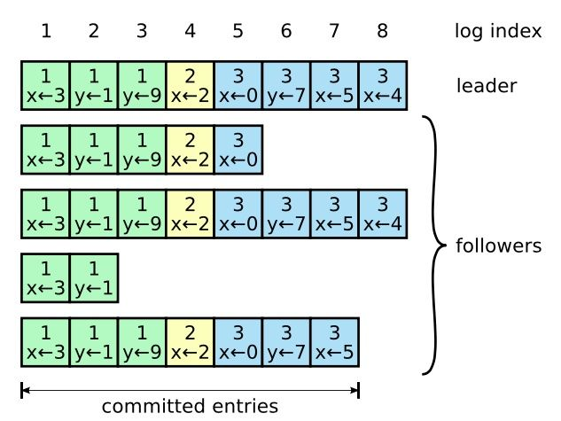

`Raft` 将一致性分解为多个子问题: `Leader election`, `Log replication`, `Safety`, `Membership change`. 同时, `Raft` 算法使用了更强的假设来减少需要考虑的状态.

* Leader: 接受客户端请求, 并向 `Follower` 同步请求日志, 当日志同步到大多数节点上后统治跟随者提交日志.
* Follower: 接受并持久化领导者同步的日志, 在被告知提交后提交日志.
* Candidate: 选举过程中的临时角色.

# Leader election

选举有两个超时时间: 选举超时和心跳超时.
如果 `Follower` 在选举超时时间内没有收到 `Leader` 的心跳, 就会等待一次随机时间后发起一次选举.

`Follower` 将其当前 `term` 加一然后转换为候选者, 先给自己投票并且给集群中的其他服务器发送 `RequestVote RPC`, 可能会出现如下三种情况:

* 赢得多数选票, 选举成功.
* 收到了 `Leader` 的消息, 表示有其他的服务器已经当了 `Leader`.
* 没有服务器赢得多数的选票, 选举失败, 等待选举时间超时后发起下一次选举(选举时间时随机的).

`Leader` 通过定期向所有 `Followers` 发送心跳来维持统治, 如果没有心跳则再次发起选举.

`Raft` 保证选举出的 `Leader` 上一定有最新的已提交的日志, 这点在安全性中.

# Log replication

某些 `Followers` 可能没有成功的复制日志, `Leader` 会无限的重试直到所有的 `Followers` 最终存储了所有的日志条目.

日志由有序编号的日志条目组成, 每个日志条目包含它被创建时的任期号和用于状态机执行的命令, 如果一个日志条目被复制到大多数的服务器上, 就被认为可以被提交了.

日志同步保证如下两点:

* 如果不同日志中的两个条目有着相同的索引和任期号, 则它们所存储的命令是相同的.
* 如果不同日志中的两个条目有着相同的索引和任期号, 则它们之前的所有条目都是完全一样的.

第一条特性来源于 `Leader` 在一个 `term` 内在给定的一个 `log index` 最多创建一条日志条目, 同时该条目在日志中的位置也从不改变.

第二条特性来源于 `AppendEntries` 的一个简单的一致性检查, 当发送一个 `AppendEntries RPC` 时, `Leader` 会把新日志条目紧接着之前的条目的 `log index` 和 `term` 都包含在里面, 如果 `Follower` 没有在它的日志中找到 `log index` 和 `term` 都相同的日志, 它就会拒绝新的日志条目.

一般情况下, `Leader` 和 `Followers` 的日志保持一致, 因此 `AppendEntries` 一致性检查通常不会失败. 然而 `Leader` 崩溃可能会导致日志不一致: 旧的 `Leader` 可能没有完全复制日志中的所有条目.

`Followers` 可能有新 `Leader` 没有的条目, 也有可能丢掉新 `Leader` 的一些条目. 丢失的或者多出来的会持续多个任期.

`Leader` 通过强制 `Followers` 复制它的日志来处理日志的不一致, 不一致的日志会被 `Leader` 的日志覆盖.

`Leader` 会从后往前试, 每次 `AppendEntries` 失败后尝试前一个日志条目, 直到找到每个 `Follower` 的日志一致位点, 然后向后逐条覆盖 `Followers` 在该位置之后的条目.

# Safety

1. 拥有最新的已提交的 `Log entry` 的 `Follower` 才有资格成为 `Leader`.

	比较原则是: 如果本地的最后一条 `log entry` 的 `term` 更大, 则 `term` 更大的更新, 如果一样大, 则 `log index` 大的更新.

2. `Leader` 只能推进 `commit index` 来提交当前 `term` 的已经复制到大多数服务器上的日志, 旧 `term` 日志的提交要等到提交当前 `term` 的日志来间接提交.

	这样可以防止出现已经提交的日志又被覆盖的情况, 在有新 `term` 的情况下, 旧的 `term` 的日志即使被同步给大多数服务器也不能被提交, 得随着新 `term` 日志的提交而提交.
	
# snapshot

实际的系统中不能让日志无限增长, 否则需要很长时间进行回放, 从而影响可用性. `Raft` 采用对整个系统进行 `snapshot` 来解决, `snapshot` 之前的日志都可以丢弃.

每个副本独立对自己的系统状态进行快照, 并且只能对已经提交的日志记录进行快照.

快照包含以下内容:

* 日志元数据, 最后一条已提交 `log entry` 的 `log index` 和 `term`.
* 系统当前状态.

当 `Leader` 要发给某个日志落后太多的 `Follow` 的 `log entry` 被丢弃, 就会将快照发过去, 当新加入一台机器时也会发送快照.

做一次快照可能耗时过长, 会影响正常日志同步, 可以通过 `copy-on-write` 技术避免影响正常日志同步.

# Membership change

成员变更不能影响服务的可用性, 但是变更过程的某一时刻, 可能出现在 `Cold`, `Cnew` 中同时出现两个不相交的多数派, 进而可能选出两个 `leader`, 形成不同的决议破坏安全性.

为了解决这一问题, 使用两阶段的成员变更方法.

1. `Leader` 收到成员变更请求.
2. `Leader` 在本地生成一个新的 `log entry`, 其内容是 `Cold∪Cnew`, 代表当前新旧成员配置共存, 写入本地日志, 同时将该 `log entry` 复制到 `Cold∪Cnew` 中的所有副本, 在此之后的新的日志同步需要保证得到这两个多数派的确认.
3. `Follower` 收到后更新本地日志, 此时以该配置作为自己的成员配置.
4. 如果两个多数派确认了 `Cold∪Cnew` 这条日志, 就提交这条并切换到 `Cnew`.
5. `Leader` 将 `Cnew` 复制到 `Follower` 上.
6. `Follower` 收到后将其写入日志, 并作为自己的成员配置, 如果自己不在成员配置中则自动退出.
7. `Leader` 收到 `Cnew` 多数派的确认后, 表示变更成功, 后续日志只要得到该派同意即可. `Leader` 给客户端回复成员变更成功.

两阶段成员变更是因为对两派的关系没有做任何假设, 为了避免形成不相交的多数派选出两个 `Leader` 才引入的方案.

可从数学上严格证明, 只要每次只改变一个成员, 那么就不可能形成两个不相交的多数派, 就可以简化为一阶段.

